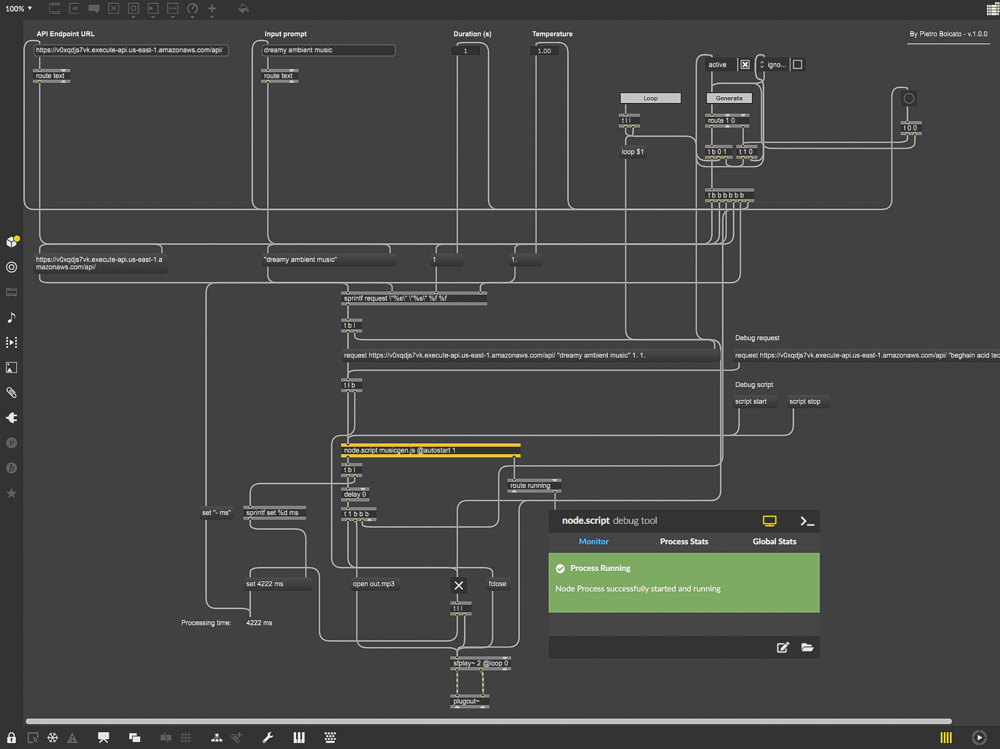

# 🎶🌈 MetaAI Musicgen — AWS Endpoint + Ableton integration

This repository implements [Musicgen](https://github.com/facebookresearch/audiocraft), 
a state of the art text-to-music model, as a scalable online endpoint in AWS Sagemaker. 
It includes a lambda function to enable public access to the endpoint, as well as a 
[Max4Live](https://www.ableton.com/en/live/max-for-live/) device that allows to 
perform inference right within Ableton Live, seamlessly integrating the model into 
any music production workflow. 

Check out the demo below! Audio on! 🔊🔽

https://github.com/pietrobolcato/musicgen-endpoint-ableton/assets/3061306/4640ae7c-a8a0-4875-beb5-8f9479ab4e26

## 🚀 Get started

1. Login to AWS: 

    ```
    aws sso login
    ```

2. Create the `dev` environment and activate it:

    ```bash
    conda env create -n dev -f envs/dev.yaml
    conda activate dev
    ```

3. Download the model artifacts: 
  
    ```bash
    cd aws/endpoint/src/artifacts/
    python download_artifacts.py
    ```

4. Create the model tar gz: 
    ```
    cd aws/endpoint/model/
    bash create_tar.sh
    ```

5. Build and publish the custom docker image for the endpoint:

    ```
    cd aws/endpoint/container/
    bash build_and_publish.sh
    ```

6. Update the deployment notebook `aws/endpoint/notebooks/deployment.ipynb`, to reflect
the url of the image published in `step 5`, and use it to register the model.

7. Change the configuration in `aws/terraform/provision_ec2/src/config-dev.yaml` and
`aws/terraform/provision_ec2/src/config-prod.yaml`. Also update the `main.tf`
backend as needed, especially in the terraform state `key`. Finally, change
`locals.tf` as needed.

8. Change the configuration of the workflow files in `.github/workflows/` as needed

9. Use github actions defined in `.github/workflows/` to execute the CD pipeline and
provision the endpoint as well as the lambda function, which will return a URL where
the REST API are exposed

10. Test that all working by sending a GET request to the URL given by the workflow 
`.github/workflows/lambda-provision.yaml`. You should get a JSON like: 

    ```json
    {
      "status": "online"
    }
    ```

11. Open Ableton Live, import the Max4Live device located under `m4l/Musicgen.amxd`

12. Set the `API Endpoint URL` parameter to the URL returned in `step 9`. Then, write a
prompt, and press `Generate`

## 🔧 Max4Live device

In Ableton Live, you can edit the Max For Live device. Feel free to do it, and submit
a pull request with new features! This is how the patch is currently implemented:



## ✨ API schema

1. Request schema

    The API endpoint accepts requests with content type `application/json`. The schema 
    for them is as following:

    ```python
    prompt: str
    duration: Optional[float] = 8.0
    temperature: Optional[float] = 1.0
    top_p: Optional[float] = 0.0
    top_k: Optional[int] = 250
    cfg_coefficient: Optional[float] = 3.0
    ```

2. Response schema

    The API endpoint equally returns `application/json`, in the format:

    ```python
    {
      "result": {
          "prediction": "<PREDICTION-IN-BASE64>",
          "processing_time_ms": "<PROCESSING-TIME-IN-MS>",
      },
    }
    ```

    Where `prediction` is a .mp3 audio file encoded in base64.

3. Example request

    For example, a valid JSON request would be:

    ```json
    {
      "prompt": "calm piano music",
      "duration": 4.0,
      "temperature": 0.8
    }
    ```

    And the response would look like:

    ```json
    {
      "result": {
        "prediction": "//voxAAAOvInHjW8gAeKw6gjO7AAAM+ze...",
        "processing_time_ms": 15124
      }
    }
    ```

## 🔥 Contributing and bug reports

For any bugs or problem you might encounter, feel free to open an issue, I would be very 
happy to help out as much as I can!

For any contribution, feel free to submit a PR. Thank you!